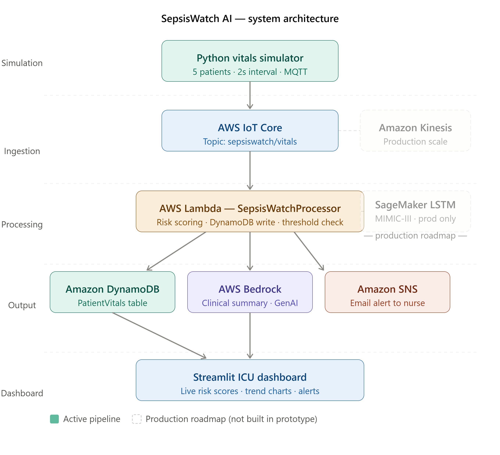

# SepsisWatch AI 🏥
### AWS-Powered Real-Time Sepsis Early Warning System

[](https://sdgs.un.org/goals/goal3)
[](https://aws.amazon.com)
[](https://python.org)

---

## Problem Statement

Sepsis is one of the leading causes of preventable in-hospital mortality in India. Most patients go undetected for **4 to 6 hours** — by which point organ failure has already begun.

The root cause is not a lack of equipment. Indian government hospitals operate at a **1:40 nurse-to-patient ratio**, making continuous individual monitoring physically impossible. Monitors already display vitals at every bedside — the data exists — but no system watches it intelligently.

Existing commercial solutions such as the Epic Sepsis Model cost lakhs per bed annually and require Western EHR infrastructure that Indian hospitals do not have.

---

## Solution

**SepsisWatch AI** is a real-time, cloud-native early warning system that continuously monitors patient vitals, predicts sepsis risk using machine learning, and instantly alerts medical staff — identifying sepsis risk hours before visible clinical deterioration occurs.

No new hardware. No EHR integration. No workflow changes. It connects to what hospitals already have and adds an intelligent AI layer on top.

---

## System Architecture



### Pipeline

```
Python Simulator → AWS IoT Core → AWS Lambda → Amazon DynamoDB
                                             → Amazon SNS (nurse alert)
                                             → AWS Bedrock (clinical summary)
                                             → Streamlit Dashboard
```

| Stage | Service | Role |
|---|---|---|
| Data Simulation | Python + awsiotsdk | Streams 5 patient vitals every 2 seconds via MQTT |
| IoT Ingestion | AWS IoT Core | Receives MQTT messages, triggers Lambda via IoT Rule |
| Risk Processing | AWS Lambda | Computes Sepsis Risk Score (0–100), writes to DynamoDB |
| Persistence | Amazon DynamoDB | Stores all vitals and risk scores (PatientVitals table) |
| Alerting | Amazon SNS | Sends email alert to nurse when risk score exceeds threshold |
| Clinical AI | AWS Bedrock | Generates plain-language clinical summary alongside each alert |
| Dashboard | Streamlit | Live ICU view — all patients sorted by risk severity |

### Production Roadmap (not in prototype)
- **Amazon Kinesis** — for high-throughput streaming at 100+ concurrent patients
- **AWS SageMaker (LSTM on MIMIC-III)** — deep learning model trained on real ICU data for higher accuracy risk scoring

---

## Features

- **Real-time monitoring** — 5 simulated ICU patients streaming live vitals continuously
- **AI risk scoring** — weighted multi-parameter model detecting HR, BP, SpO2, RR, and temperature deviations
- **4-level risk classification** — Low / Low-Medium / Medium / High with probability and confidence scores
- **Instant SNS alerts** — email notification fires automatically when risk score crosses threshold
- **AWS Bedrock clinical summary** — plain-language AI explanation tells the nurse exactly what is wrong and what to do
- **Live dashboard** — Streamlit ICU command center with trend charts, sorted by severity
- **Explainability** — dashboard shows which vitals are driving the elevated risk score

---

## Technology Stack

| Layer | Technology |
|---|---|
| Language | Python 3.12 |
| IoT & Streaming | AWS IoT Core (MQTT via awsiotsdk) |
| Compute | AWS Lambda |
| Database | Amazon DynamoDB |
| Alerting | Amazon SNS |
| Generative AI | AWS Bedrock |
| ML Model | Random Forest Classifier (scikit-learn) |
| Dashboard | Streamlit |
| Hosting | Amazon EC2 t2.micro |

---

## Installation & Setup

### Prerequisites
- Python 3.10+
- AWS account with IAM user configured
- AWS IoT Core Thing with certificates

### 1. Clone the repository
```bash
git clone https://github.com/Rohithp1105/sepsiswatch-ai.git
cd sepsiswatch-ai
```

### 2. Install dependencies
```bash
pip install -r requirements.txt
```

### 3. Configure environment
```bash
cp .env.example .env
```
Edit `.env` with your AWS credentials and IoT endpoint.

### 4. Add IoT certificates
Place your AWS IoT certificates in the `certs/` folder:
- `*-certificate.pem.crt`
- `*-private.pem.key`
- `AmazonRootCA1.pem`

### 5. Train the ML model
```bash
python ml/generate_dataset.py
python ml/train_model.py
```

### 6. Run the simulator
```bash
python simulator/vitals_simulator.py
```

### 7. Run the dashboard
```bash
streamlit run dashboard/app.py
```

---

## Usage Guide

1. Start the vitals simulator — it streams live data for 5 ICU patients into AWS IoT Core
2. AWS IoT Core triggers Lambda on every message via the `SepsisWatchRule`
3. Lambda computes the risk score and writes to DynamoDB
4. If score exceeds threshold (65/100), SNS sends an alert email to the configured nurse address
5. Open the Streamlit dashboard to see all patients live, sorted by risk severity
6. High-risk patients are highlighted in red with actionable recommendations

**Demo patient:** Patient 103 (Arjun) is configured with `severity: 3` and will progressively deteriorate toward sepsis-level vitals, triggering an alert within 2-3 minutes of starting the simulator.

---

## Project Structure

```
sepsiswatch-ai/
├── simulator/
│   ├── vitals_simulator.py       # AWS IoT Core MQTT publisher
│   ├── patient_profiles.py       # Patient definitions and severity levels
│   ├── patient_state.py          # Initial vital state per patient
│   └── vitals_generator.py       # Realistic vital update logic
├── ml/
│   ├── generate_dataset.py       # Generates 50,000 synthetic ICU records
│   ├── train_model.py            # Trains Random Forest classifier
│   ├── predict.py                # Inference wrapper
│   └── model.pkl                 # Trained model (generated locally)
├── lambda/
│   └── handler.py                # Lambda function — risk scoring + DynamoDB + SNS
├── dashboard/
│   ├── app.py                    # Streamlit ICU dashboard
│   └── history.py                # In-memory vital history tracker
├── utils/
│   └── risk_engine.py            # Rule-based risk scoring engine
├── architecture/
│   └── system_architecture.png   # System architecture diagram
├── certs/                        # AWS IoT certificates (not committed)
├── requirements.txt
├── .env.example
└── README.md
```

---

## Team Details

**Team Name:** HackZen
**College:** Sri Manakula Vinayagar Engineering College (SMVEC)
**Hackathon:** #include 1.0 — AWS Student Builder Group Hackathon

| Name | Role |
|---|---|
| Nivetha B (Team Lead) | Project architecture and documentation |
| Abitha MSR | ML model and risk scoring |
| Siva Sakthivel G | AWS pipeline and Lambda integration |
| Rohith P | Simulator, dashboard, and deployment |

---

## Impact

With even a **15% improvement** in early sepsis detection across Indian government hospitals, an estimated **40,000+ lives** could be saved annually.

SepsisWatch AI is fully serverless and AWS-native — it scales from a single ward pilot to a multi-hospital deployment with no infrastructure changes and minimal cost increase.

**SDG-3 aligned:** Good Health and Well-Being.
